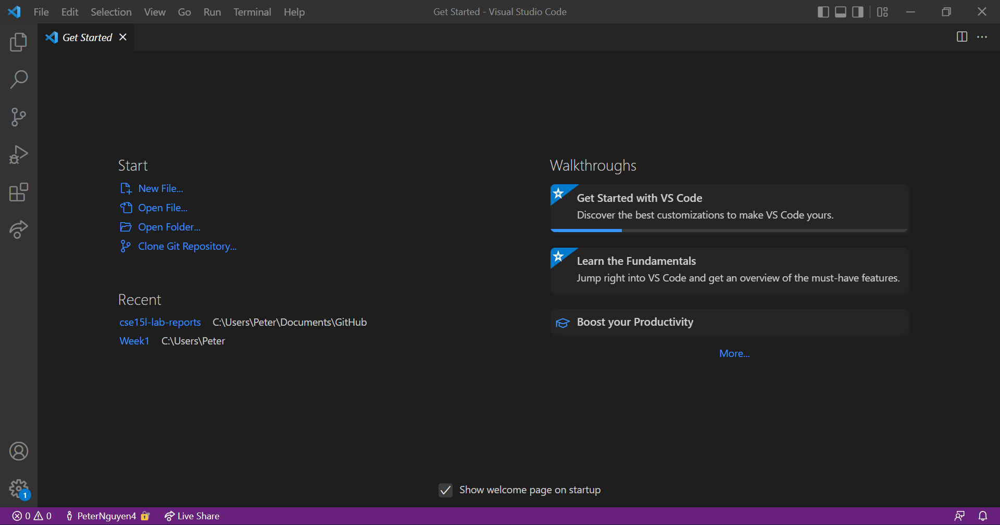
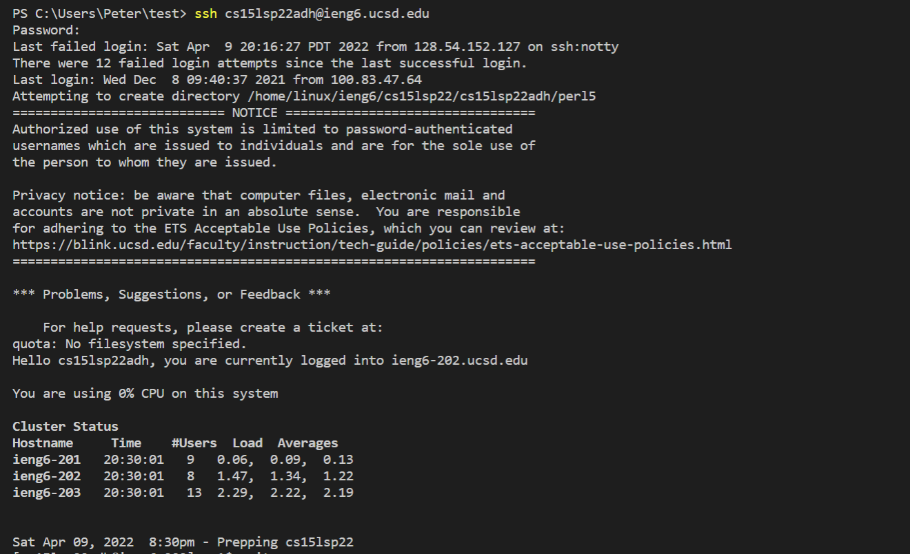
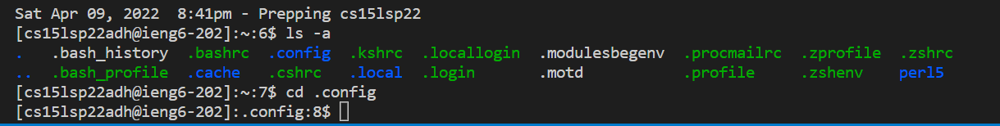
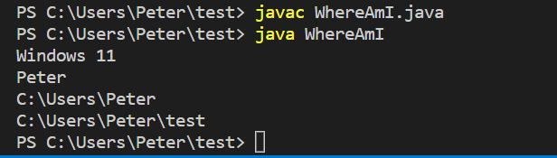
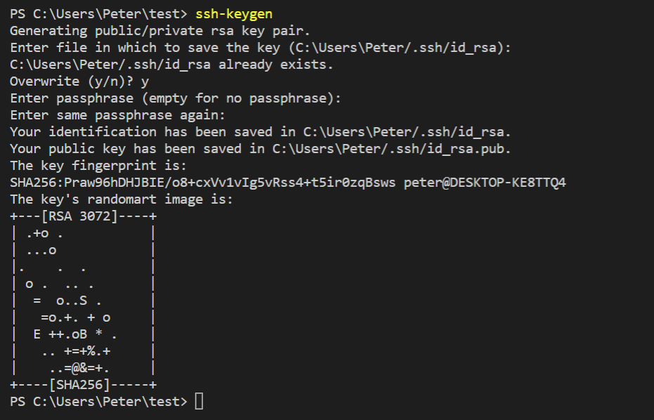
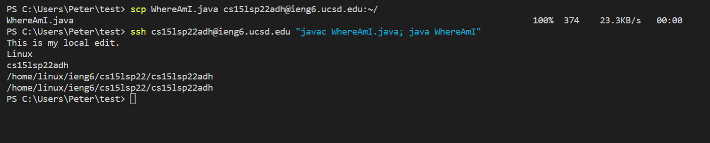

# Week 2 Lab Report 1
Hey incoming *CSE 15L* students! This report will explain how to log into a course-specific account on `ieng6`. As a little reminder, course-specific accounts allow us to gain remote access to computers over the Internet, which is a convenient way to do some work!

## Installing VScode
---
Even before working with remote access, we first need an IDE. Our class uses **Visual Studio Code** which you can download and install at [https://code.visualstudio.com/](https://code.visualstudio.com/). 

Once set up, an opened window of VScode should look like this:

*Color themes and formatting may look different depending on settings*

* Note that you may be prompted to install an extension pack, which is recommended for better usability of VScode.

## Remotely Connecting
---
After [installing OpenSSH](https://docs.microsoft.com/en-us/windows-server/administration/openssh/openssh_install_firstuse) **if on Windows** and finding your course-specific account for *CSE15L* through [https://sdacs.ucsd.edu/~icc/index.php](https://sdacs.ucsd.edu/~icc/index.php), you are now ready to begin!

Enter the command `$ ssh cs15lsp22zz@ieng6.ucsd.edu` in a newly opened a terminal in VSCode, replacing `zz` with the your the letters on your course-specific account.

* New terminal opened with Ctrl + `, or go to Terminal → New Terminal on the menu
* You will likely be prompted with a lengthy message asking for a response, in which you should answer "yes" and continue to enter your password.

.png)

## Trying Some Commands
---
Try entering the following commands into the terminal to navigate through VScode:

* `cd`
* `ls`
* `pwd`
* `mkdir`
* `cp`

Here, I used `ls -a` to get a list of the directories as well as `cd .config` to change the directory to `.config`.

## Moving Files with `scp`
---
Create a file called `WhereAmI.java` with the following lines of code and run it with `javac` and `java`.

In the same terminal, run the command
`scp WhereAmI.java cs15lsp22zz@ieng6.ucsd.edu:~/`, enter the same password as with ssh, and log in once again with `ssh` but use `ls` to see the file's location on the server. Now you can run it remotely with `javac` and `java`!

.png)

## Setting and SSH Key
---
To log in without having to type our password, we first need to set up a key using `ssh-keygen`. Follow the prompts as seen below and a key should be generated.

* Note that I have already set up a key, so the terminal asks if I would like to override my previous one.

Next, copy the *public* key file (id_rsa.pub) to the server by first loggin into `ssh`, typing `mkdir .ssh`, exiting the server, and typing `scp /Users/<user-name>/.ssh/id_rsa.pub cs15lsp22zz@ieng6.ucsd.edu:~/.ssh/authorized_keys` on your client.
.png)
* The message after `mkdir. ssh` should not appear in your terminal.
* Be sure to use your own username and course-specific account.

## Optimizing Remote Running
---
To best optimize, we can use semicolons to run multiple commands in the same line and the up-arrow to get the previous command. With this in mind, I was able to run the commands in two keystrokes.

1. The first line copies the edited file from the client to the server.
2. The second line logs into the server (using a key), compiles, and runs the file.
