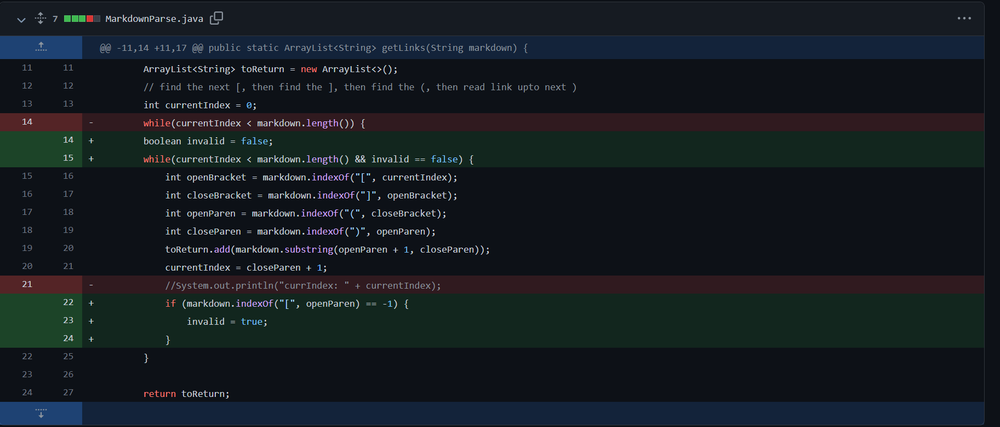
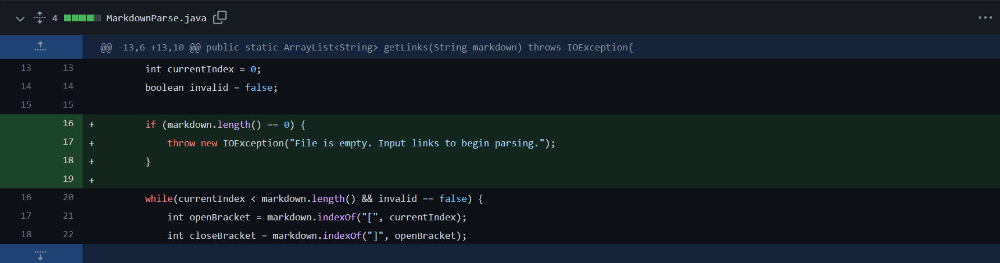
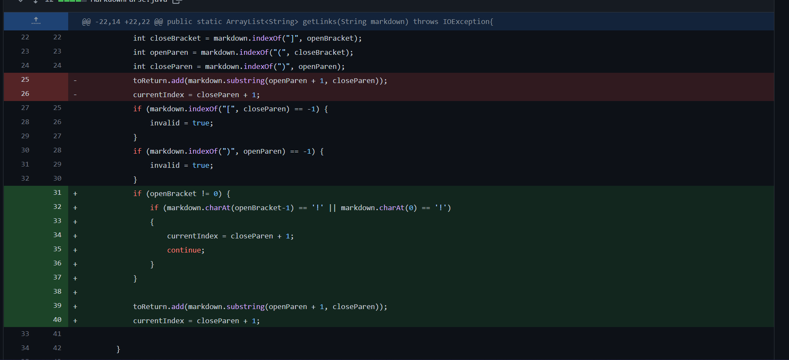

# Week 4 Lab Report 2

* [second-test-file.md](https://github.com/PeterNguyen4/markdown-parser/blob/main/second-test-file.md)

.png)

In this **first** example, we see that the *failure-inducing input* is the presence of a space in between different lines of codes separating links. The bug in the current program is a logic error because it fails to address the case in which there is a blank (or *invalid*) line between links. The symptom of this bug is that the program crashes (`OutOfMemoryError`) when we try to run the code on the invalid file; the bug yields a symptom, which is manifested when we try to run the code on a *failure-inducing input*.

---

* [third-test-file.md](https://github.com/PeterNguyen4/markdown-parser/blob/main/third-test-file.md)

.png)

In this **second case**, the *failure-inducing input* is the image link, which should not be included in the final output because it is not a valid link format. The bug here, similar to the first example, is a logic error in which I fail to address the presence of an image as a possible link. Because it only has an additional `!` character in front of the link formatting, this the program compiles but outputs `l3.com` when it should be excluded from the list.

---

* [fourth-test-file.md](https://github.com/PeterNguyen4/markdown-parser/blob/main/fourth-test-file.md)

.png)

The **third case** tackles an empty file as the *failure-inducing input*, and is once again a logic error. I included a try-catch block to throw an `IOException` come run-time, because I did not account for the possibility of an empty file when implementing the code. As a result, the symptom of the bug is that the program outputs an empty ArrayList when it should throw an error that presents a message prompting the user to input proper links.

