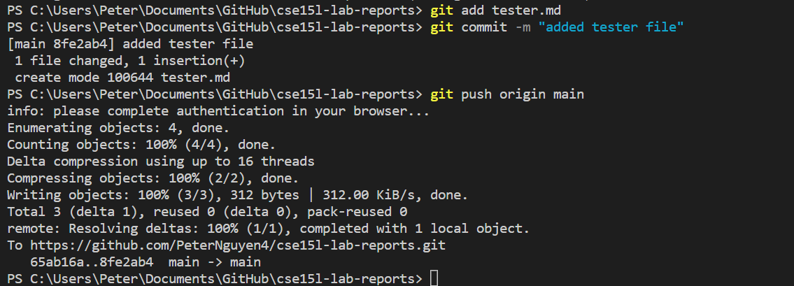
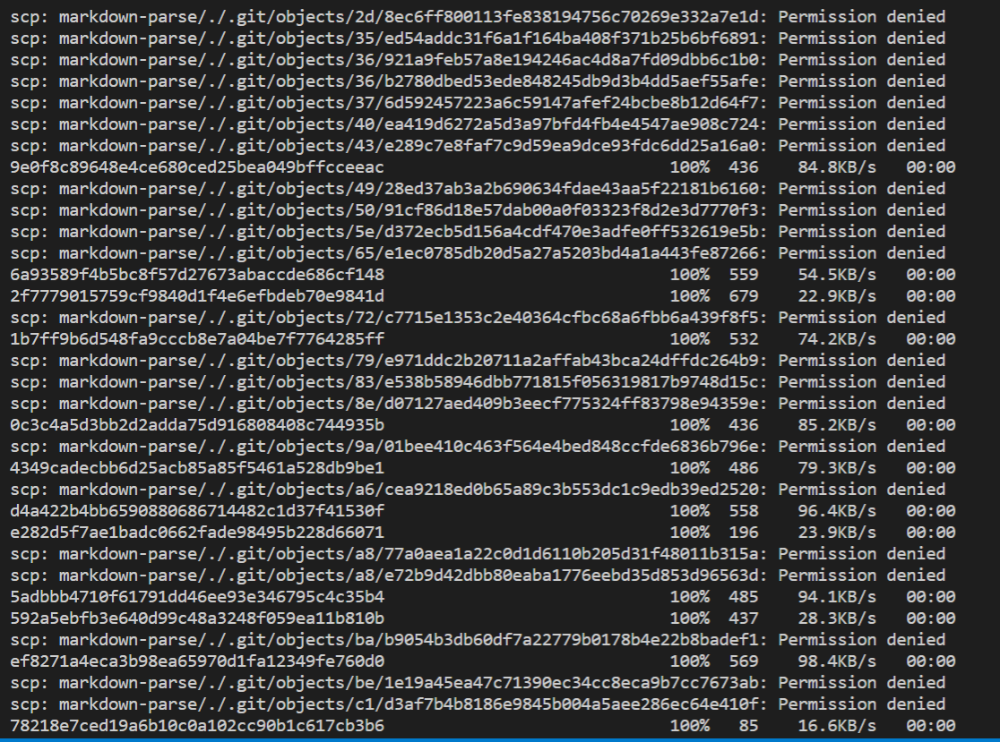

# Week 6 Lab Report 3

## Streamlining SSH Configuration
When logging into `ieng6` through a remote connection (i.e. laptop or PC) we must type a redundant line of code like `ssh cse15lsp22zzz@ieng6.ucsd.edu` which can be rather cumbersome. By configuring `~/.ssh/config`, we are able to simplify this process and make logging into SSH much easier!

First, open a new terminal and enter `cd ~/.ssh` to change the directory of your computer. Then, one way to access the config file is through `notepad config` once in the ssh directory.


Enter the following lines into the file

```
Host ieng6
    HostName ieng6.ucsd.edu
    User cs15lsp22zzz (use your username)
```

The result should resemble this but using your *course-specific account*


Here, I log into SSH using just the alias:


To show this streamlining in action, lets copy a local file to the remote server using `scp`!


* By remotely connecting with `ssh ieng6` and entering `ls` into the terminal, we see that `test-file.md` was sucessfully copied into ssh

---
## Github Access from `ieng6`

Here is the SSH key on Github, having copied the information from the `id_rsa.pub` file.


Inside the ssh directory, we can also see the *public* key (`id_rsa`) as well as the *public* one (`id_rsa.pub`) on my user account


By setting up an SSH key in Github, we are now able to use commands like `git add` and `git push origin main` through the terminal, as opposed to Github Desktop.



We can see the **git diff** [here](https://github.com/PeterNguyen4/cse15l-lab-reports/commit/8fe2ab4dde7280aaba56d2271beab5daa37f8987), in which I have created a new file and added some text.

By creating another key on `ieng6` through `ssh-keygen` and adding it to Github, we are also able to run git commands while logged into the remote server!


---

## Copy whole directories with `scp -r`

In this final section, we are able to copy a whole directory ***recursively*** with the command `scp -r . ieng6:markdown-parse`




To test the validity of this copying process, I have logged into `ieng6` and ran the tests here:


By entering the following command
```
scp -r . ieng6:~/testDirec; javac -cp .:lib/junit-4.13.2.jar:lib/hamcrest-core-1.3.jar MarkdownParseTest.java; ssh ieng6; cd testDirec; java -cp .:lib/junit-4.13.2.jar:lib/hamcrest-core-1.3.jar org.junit.runner.JUnitCore MarkdownParseTest
```
we are able to copy a directory through scp and test it all in one line!


