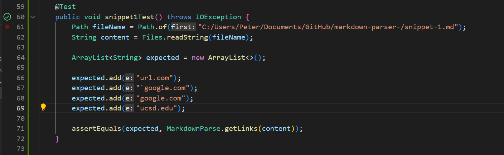

# Week 8 Lab Report 4

# Running Snippets
Here are the tests for ***my*** implementation of `mardown-parse`:

* Snippet 1


* Snippet 2


* Snippet 3

And these are the tests for the ***reviewed*** implementation

* Snippet 1


* Snippet 2


* Snippet 3

---

## Explanation

[**This**](https://github.com/PeterNguyen4/markdown-parser) is the link to my `markdown-parse` repository, and the link to the one I reviewed can be found [**here**](https://github.com/aaronchan32/markdown-parser).

Using the `Preview` option within VSCode, I found the these outputs:
* Snippet 1: 
```
[url.com, `google.com, google.com, ucsd.edu]
```

* Snippet 2:
```
[a.com, a.com(()), example.com]
```

* Snippet 3:
```
[https://sites.google.com/eng.ucsd.edu/cse-15l-spring-2022/schedule]
```

In the six photos above, I have also shown the tests seen in `MarkdownParseTest.java`. I used the `Preview` option, as I have previously mentioned, to see which options would appear as valid links. I then added the names of these links to the `expected` ArrayLists of their respective JUnit tests.

These same photos show that I successfully passed the test of *Snippet 1*, as denoted by the green check mark on the left of the code. 
.png)

However, the *Snippet 2* yielded a `java.lang.AssersionError` followed by the incorrect output 
.png)

while *Snippet 3* outputted `java.lang.IllegalArgumentException`.
.png)

As for the implementation I reviewed, all three tests failed:
.png)
.png)
.png)

---

## Implementation

1. My implementation already does seem to work correctly for `snippet-1.md`, perhaps because it was quite strict with parsing (the backtick is just seen as another character and does not effect the output). However, one deliberate change I could make is to have the parse neglect the backtick while it is the first character in a line, as is the case with images which use the `!` character.

2. I do not believe that I could change my code in a concise manner to handle the case of nested parentheses, brackets, and escaped brackets because each case can be quite situational. My `getLinks()` method would have to be able to keep track of the starting brackets and/or parenthesis but also recognize that there may be the potential addition of a nested link. From here, I would have to equate relevant parentheses and/or brackets to see if the nested links are valid and properly within the original link.

3. For `snippet-3.md`, a change to address newlines within brackets and parentheses would be manageable under 10 lines of code. Once the parser is within a set of parentheses or brackets, it could apply a similar concept as we have done outside of the link to continue running smoothly. With this case, however, the parser needs to neglect all of the involved newlines and find the first instance of a valid `closeBracket` or `closeParen`.

