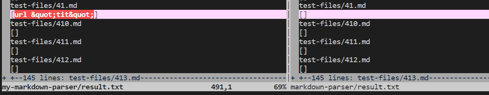
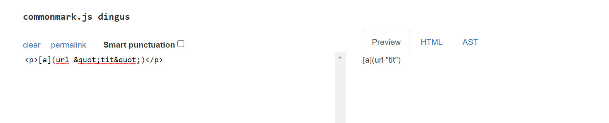
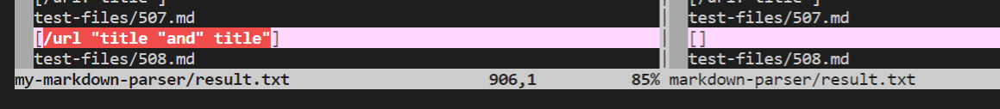
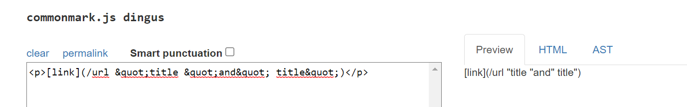

# Week 10 Lab Report 5

## Finding Different Results
The following line allowed me to identify the difference in test implementations:

```
vimdiff markdown-parser/result.txt my-markdown-parser/result.txt
```

The two `result.txt` files were based on running `bash script.sh > result.txt` within their respective directories while logged onto `ieng6`. `vimdiff` allowed me to manually find which implementations were different between the parser from Lab 9 and that of my own because I was visually able to pick out which outputs were different. From here, I used **[the CommonMark demo site](https://spec.commonmark.org/dingus/)** to verify the expected output.

## Test 1
The first test that I chose was on **[test-files/41.md](https://github.com/nidhidhamnani/markdown-parser/blob/main/test-files/41.md)**.


* `my-markdown-parser` on the left, `markdown-parser` on the right

Here the expected output from CommonMark.


Adhering to the structure of this class's parser `my-markdown-parser` would have the correct implementation of `test-files/41.md` because it returns the name of the link within the parenthesis in a list, while `markdown-parser` only returns an empty list. This is somewhat comfirmed by the output seen with the CommonMark site, because only the indexes within the brackets and parentheses are properly identified. However, the expected output should only be `[url "tit"]`. The issue is that both implementations are not complex enough to identify the markdown commands like quotations while parsing. Instead, it reads ALL relevant characters, which could possibly be fixed by adding if statements to apply markdown commands when they do appear within the parentheses.

---

The second test with a differing output was **[test-files/507.md](https://github.com/nidhidhamnani/markdown-parser/blob/main/test-files/495.md)**.


* `my-markdown-parser` on the left, `markdown-parser` on the right

Here the expected output from CommonMark.


As seen which this test file as well, `my-markdown-parser` provides the correct output when considering the guidelines for this class, while `markdown-parse` returns an empty list. When reviewing the CommonMark, we see that the former is closer to the expected outcome of `test-file/507.md`, but they are both still incorrect in their own respect. As previously mentioned, the biggest issue is that both implementations do not factor in notation while parsing links. The same solution of implementing if statements could still hold true here, as the parser could insert a quotation character when it reaches the the the `&quot;` phrase and other commands in a similar situation within parentheses. 
